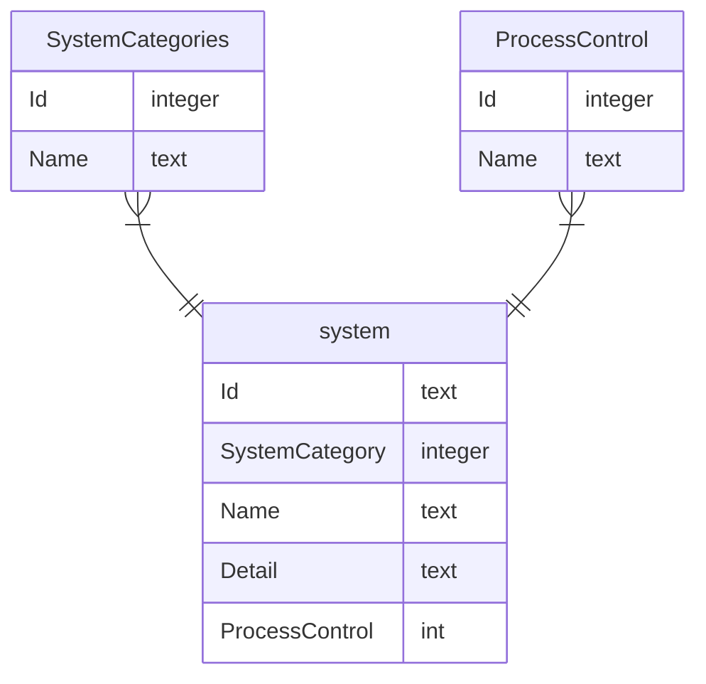

# systeminventory

#### データベースについて  



#### 開発環境について

以下のソフトをDLする。

- .NET6 SDK  
<https://dotnet.microsoft.com/ja-jp/download/dotnet/6.0>  
- ASP.NET core ランタイム
<https://dotnet.microsoft.com/ja-jp/download/dotnet/6.0>  
- Node.js  
<https://nodejs.org/en/>  
インストール後にコマンドプロンプトで以下のコマンドを入力してインストールの可否を確認。  

```cmd
node --version
```

```
npm --version
```

それぞれバージョンが表示されたらインストールは成功  

- Angular CLIのインストール  
<https://angular.jp/cli>

```
npm install -g @angular/cli
```

- VScodeのインストール
<https://code.visualstudio.com/download>  
以下の拡張機能をInstallする。  

  - C#
  - Angular Language Service  

#### 実際の開発について  

1. GitHubリポジトリからシステムをGit cloneなどで、
DLする。  

1. C#のバックエンドとAngularの実行方法が異なるため、
それぞれ実行する。  
   - C#について  
   apiというフォルダでコマンドプロンプトを開き以下のコマンドを入力する。

   ```
   dotnet run
   ```

   - Angularについて
   clientappというフォルダでコマンドプロンプトを開き、
   以下のコマンドを実行する。

   ```
   ng serve
   ```
